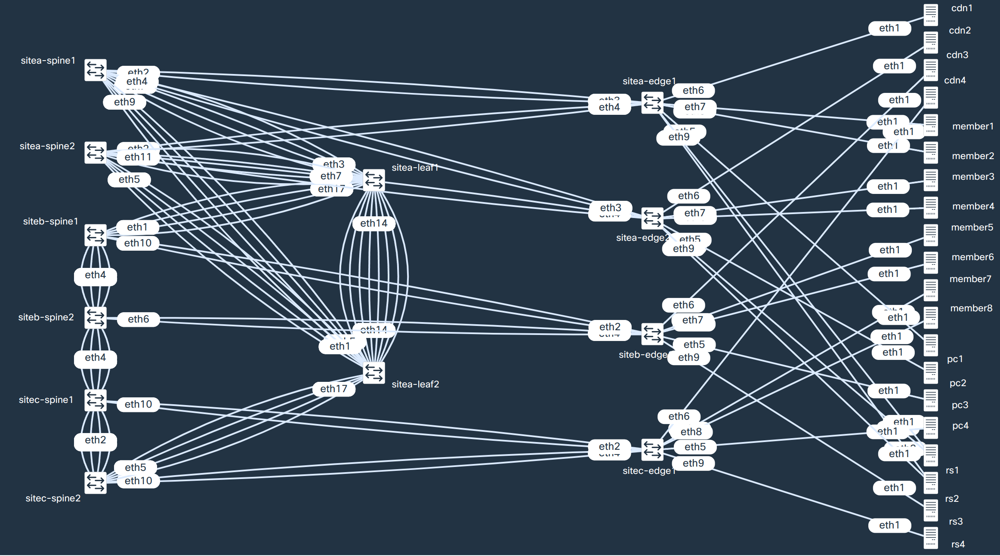

# VXLAN & EVPN on IXP: Adapt or LAG

## Requirements

In order to run this project you must have the following software installed:

* [docker](https://docs.docker.com/engine/install/) (podman was not tested yet)
* [containerlab](https://containerlab.dev/install/)
* [yq](https://mikefarah.gitbook.io/yq/)

A [Vagrant](https://www.vagrantup.com/) file is provided for running containerlab in a VirtualBox VM.

## TL;DR

Be sure to be inside a terminal in a brand new Ubuntu Desktop VM

```bash
sudo su
apt update
apt install -y git curl konsole
curl -L get.docker.com | bash
snap install yq
bash -c "$(curl -sL https://get.containerlab.dev)"
git clone https://github.com/LACNOG/lab-ixp-vxlan-evpn.git
cd lab-ixp-vxlan-evpn
./lab.sh configure
./lab.sh start
./lab.sh connect

# Enjoy!
```

## Topology



## Usage

```bash
# Configure the lab
# The lab won´t start until you configure it
./lab.sh configure

# Start the lab
./lab.sh start

# Connect to all devices
./lab.sh connect

# Just connect to edge devices
./lab.sh fun

# Backup changes
./lab.sh backup

# Stop the lab
./lab.sh stop

# Clean the configurations to start from scratch
./lab.sh cleanup

# Uninstall everything
./lab.sh uninstall
```

Proudly developed by [Ariel S. Weher](https://weher.net) <ariel[at]weher[dot]net>

LICENSE: [CC-BY-NC-SA 4.0](https://creativecommons.org/licenses/by-nc-sa/4.0/)